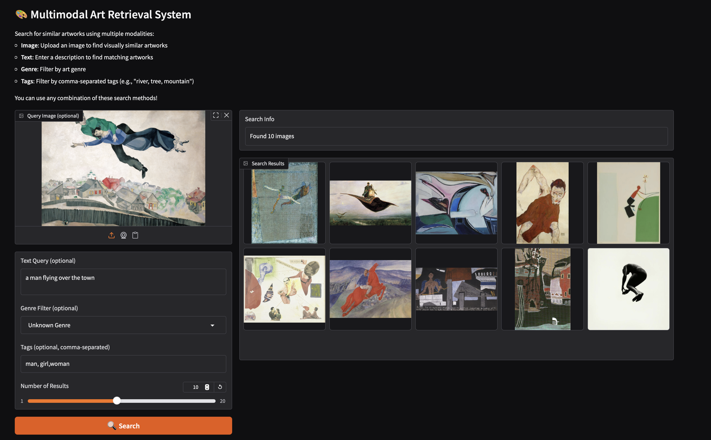
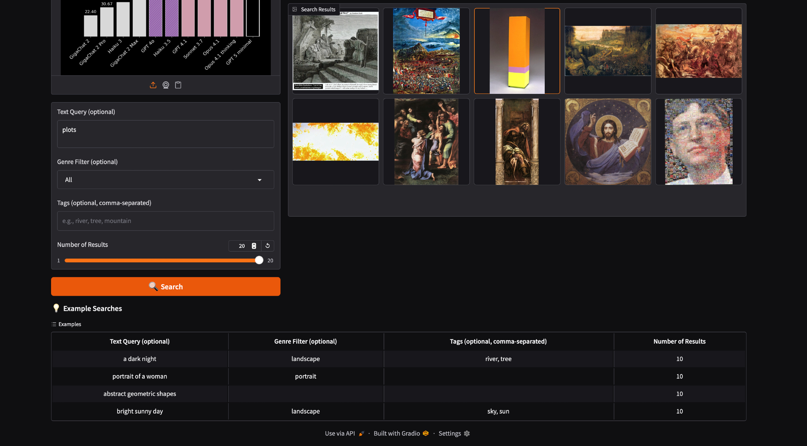
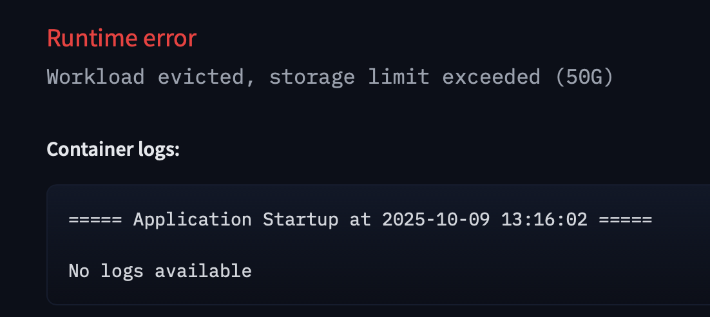

# Multimodal Art Retrieval System

## Demo

  
  

⚠️ **HuggingFace Deployment Note**: Unable to deploy the demo on HuggingFace Spaces due to the 50GB storage constraint. The model files and FAISS indices exceed this limit.

---

## Tasks Overview

### ✅ 1. Image→Image Retrieval (3 points)
- **Image Encoder**: Selected a pre-trained vision model to extract image embeddings
- **Index Construction**: Built FAISS index for efficient similarity search
- **Demo**: Implemented top-10 nearest neighbor retrieval for visual similarity search across 10 diverse examples

### ✅ 2. Caption→Image Retrieval (3 points)
- **Captioning Model**: Used VLM for automatic caption generation
- **Caption Examples**: Generated descriptive captions for artwork dataset
- **Index & Demo**: Built caption-based retrieval index, demonstrated top-10 results for 10 examples
- **Dataset Publication**: Published generated captions dataset (image metadata + captions)

### ✅ 3. Omni→Image Retrieval (4 points)
- **Zero-Shot Features**: Generated genre, style, and semantic tags using Vision-Language Model
- **Multi-modal Search**: Implemented flexible search combining text queries, genres, and extracted features

### ✅ Bonus: Interactive Demo (3 points)
- Created Gradio/Streamlit demo with all three retrieval functionalities
- Interactive interface for image upload, text queries, and tag-based search

---

## Dataset
WikiArt dataset from HuggingFace (all 81k+ artworks)

## Implementation
See `solution.ipynb` for full implementation details and results visualization.

